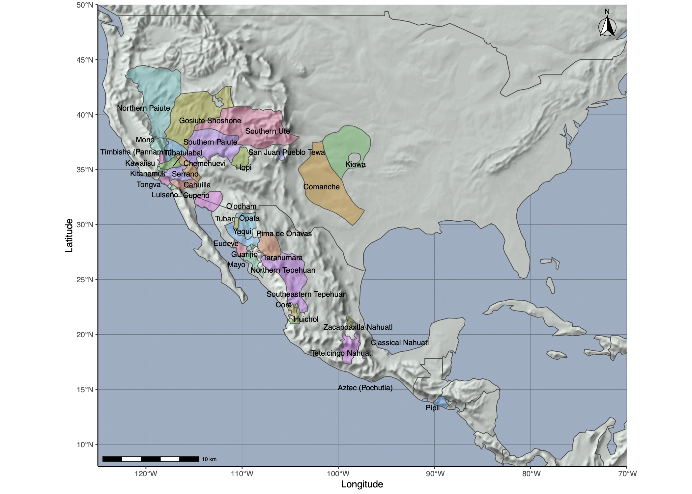

```{r setup, include=FALSE}
knitr::opts_chunk$set(echo = TRUE)
```

## Phylogenetic comparative Methods

We will be looking at the Uto-Aztecan language family using some unpublished trees
from Greenhill, Haynie et al. forthcoming. 

The Uto-Aztecan language family is one of the largest in North America in terms of the number of individual languages, the number of speakers of those languages before European colonisation, and the extent of its attested spatial range. However, there is ongoing debate about whether these people originated in the south or in the north. 

In the **southern origin scenario**, the Uto-Aztecans came from southern Mexicon in Meso-america as an expanding population of Maize agriculturalists, bringing maize and farming with them into north America. However, as they moved northwards they reached places that were bad for growing maize and reverted to hunting and gathering.

In contrast, the **northern origin scenario** argues that the Uto-Aztecans were originally hunter-gatherers in Southern California’s Mojave Desert and the Sonoran and Chihuahuan desert regions of Arizona and Northern Mexico. Climate change led them to expand southwards where the acquired maize and agriculture after they entered Meso-America.

Here is a map of the languages, Let's see if we can figure out something interesting about where farming might have originated 




### Load Libraries

Load the libraries we will need. You will need to install them first if you have not already done so, i.e. run `install.packages(packagename)` e.g.: `install.packages('ape')` the first time.

```{r}
library(ape)
library(dplyr)
library(caper)
library(ggplot2)
library(phytools)
```

### Download trees


Here are 100 phylogenies sampled from the Posterior Probability Distribution:

```{r}
trees <- read.nexus("utoaztecan.trees")
trees
```

You can see that we have 100 trees to play with, but let's choose one at random for now:

```{r}
tree <- trees[[19]]
```

### Plot the tree:

Look at the tree we've got:

```{r}
plot(tree)
axisPhylo()
```

### Download data

I've extracted some data from the Ethnographic Atlas on [D-PLACE](d-place.org/) for you. Load them all, and look at the variables and see what we have:


```{r}
data <- read.csv('utoaztecan.csv', header=TRUE, na.string="")
rownames(data) <- data$Taxon
```

We have the following variables:

* EA202 - Population size.
* EA005 - Subsistence economy: agriculture.
* EA029 - Major Crop Type.
* EA008 - Domestic organization.
* EA034 - Religion: high gods.
* EA082 - House construction: shape of roof.
* EA112 - Trance states.
* MammalRichness - Number of coexisting mammal species
* MonthlyMeanNetPrimaryProduction - Net primary production per month (grams of carbon uptake per square meter of land per month)

The command `View(data)` is a good tool for browsing thedataset.

```{r}
head(data)
```

### EA005 Subsistence economy: agriculture

The first variable we will look at is EA005, how much of the subsistence do these societies get from agriculture.

To start with, let's plot this variable on a map. I'm just using the latitude/longitude as x and y locations to give you a rough guide but R has some amazing mapping abilities if you want to dive into that. 

This plot matches what we saw in the introduction, the societies in the north have lower dependence on agriculture than those in the south.


```{r}
ggplot(data, aes(x=Longitude, y=Latitude, color=EA005)) +
    geom_point() +
    theme_bw()
```

Ok, this also looks like we have a major distinction here between almost no agriculture (0-5%), small amounts (6-15%), and lots of agriculture (>45%). We have quite a small tree here, and reducing the states into this three way distinction will make it easier to fit a model.

So, collapse this variable into a three-way distinction between None, 5-45%, >46%: 

```{r}
data$EA005.recoded <- dplyr::recode(data$EA005,
  "Zero to 5 percent dependence" = 0,
  "6 to 15 percent dependence" = 1,
  "46 to 55 percent dependence" = 2,
  "56 to 65 percent dependence" = 2,
  "66 to 75 percent dependence" = 2,
  "76 to 85 percent dependence" = 2
)
```

...and now let's see how this patterns onto our phylogeny? Hmm, we can see that the societies in 
south, e.g. Classical Aztecan, Northern Tepehuan, Yaqui, have quite high levels
of maize subsistence. In the north, most societies have low agriculture, except
for Hopi. 

```{r}
plot(tree)
tiplabels(data[tree$tip.label, 'EA005.recoded'], bg=data[tree$tip.label, 'EA005.recoded'])
```

### EA029 major crop type

Another interesting variable is EA029, major crop type. In these societies, you 
have Cereals (=Corn) or nothing. Let's look at it.

We see the same pattern -- rare in the north, common in the south.

```{r}
ggplot(data, aes(x=Longitude, y=Latitude, color=EA029)) +
     geom_point() +
     theme_bw()
```

Let's recode this on to a presence/absence variable:

```{r}
data$Maize <- dplyr::recode(data$EA029,
  "No agriculture" = 0,
  "Cereals" = 1
)
```


```{r}
plot(tree)
tiplabels(data[tree$tip.label, 'Maize'], bg=as.factor(data[tree$tip.label, 'Maize']))
```


### EA034 -  Religion: high gods.

This variable tracks whether the society has a high god, it has the following states:

* "A high god absent or not reported in substantial descriptions of religious beliefs"
* "A high god present but otiose or not concerned with human affairs"
* "A high god present and active in human affairs but not offering positive support to human morality"
* "A high god present, active, and specifically supportive of human morality" 

Let's recode this to whether they have a high god or not:


```{r}
data$HighGod <- dplyr::recode(data$EA034,
  "A high god absent or not reported in substantial descriptions of religious beliefs"=0,
  "A high god present but otiose or not concerned with human affairs"=1,
  "A high god present and active in human affairs but not offering positive support to human morality"=1,
  "A high god present, active, and specifically supportive of human morality"=1
)
```

```{r}
plot(tree)
tiplabels(data[tree$tip.label, 'HighGod'], bg=as.factor(data[tree$tip.label, 'HighGod']))
```

Hmm - this one looks like it's all over the place.


### Phylogenetic signal

Ok, let's formally measure the fit of the data onto the tree.

#### Binary Data

A good method for measuring the phylogenetic signal of binary characters is Fritz and Purvis' _D_. This statistic measures the sum of sister clade differences, if the trait is maximally clumped then neighbors will have the same state. 

_D_ can be interpreted as follows:

* D > 1: Overdispersed (phylogenetic ANTI-signal)
* D = 1: Phylogenetically Random clustering (i.e. very little signal)
* D = 0: Clumped according to Brownian motion.
* D < 0: extremely clumped.
    
This is implemented in the ``caper`` library:

**Maize:**

```{r}
phylo.d(data, tree, Taxon, Maize)
```

What does this tell us about our Maize character? it says that the Maize character shows strong phylogenetic clumping (~= -0.7 in my tree)  consistent with this tracking the phylogeny pretty well. 

**High God:**

```{r}
phylo.d(data, tree, Taxon, HighGod)
```

In contrast the high gods variable has a _D_ of ~1.7 which means this trait is overdispersed (i.e. closely related societies have more different gods than you would expect). This suggests that mapping high gods onto these trees may not be a good idea.


* Fritz, S. A., and A. Purvis. 2010. Selectivity in Mammalian Extinction Risk and Threat Types: a New Measure of Phylogenetic Signal Strength in Binary Traits. Conservation Biology 24:1042-1051.

#### Continuous data

We can also get a measure for continuous data, like our variables `EA202 Population Size` (Population of ethnic group as a whole) and  `MammalRichness` (an ecological variable that measures how many mammals are present in the area that the society is in). 

We will use a metric called Blomberg's _K_. _K_ = 1 when the trait shows the amount of phylogenetic signal expected when evolving under a Brownian motion process (i.e. neighboring tips are more similar). 

**EA202 - Population Size:**

```{r}
phylosig(tree, data[tree$tip.label, 'EA202'])
```

**Mammal Richness:**

```{r}
phylosig(tree, data[tree$tip.label, 'MammalRichness'])
```
We can see that Population Size has a _K_ of ~0.96, close to 1 which suggests that
this trait maps onto the tree well -- societies close on the tree tend to have very similar population sizes.

On the other hand, Mammalian Richness doesn't fit well, _K_ is ~0.37. This makes sense, I think, as it would be a bit odd for Mammal Richness to show phylogenetic signal (it's not like the societies are inheriting a quota of mammals). 

**Phylogenetic Uncertainty:**

Note that the actual values you get here will be different if you chose a different tree due to the variation in the tree topology, so let's try across the full posterior to see what sort of variation we get:

```{r}
sigs <- sapply(trees, function(t) { phylosig(t, data[t$tip.label, 'MammalRichness'], test=FALSE)[[1]][[1]]})
sigs <- data.frame(tree=1:100, K=as.numeric(sigs))

ggplot(sigs, aes(x=K)) + geom_histogram() + theme_bw()
```


Interestingly, it looks like most of the time the Mammalian Richness variable fits badly, but one tree has a _K_ around 0.95. This is a good case of why we need to calculate statistics over the full posterior -- if we'd randomly chosen that one tree we would conclude that Mammalian Richness tracked the phylogeny well, but 99% of the time it doesn't.

### Ancestral State Reconstruction

Time for some ancestral state reconstruction. We want to know how likely it was that the ancestral Proto-Uto-Aztecan society had agriculture. 

```{r}
states <- as.numeric(data[tree$tip.label, 'EA005.recoded'])
names(states) <- tree$tip.label

# we will rescale the tree to keep the likelihood optimiser happy
tree.rescaled <- tree
tree.rescaled$edge.length <- tree.rescaled$edge.length / 100
```

Fit the three models:

**Equal Rates:***

```{r}
rER <- ace(states, tree.rescaled, type="discrete", model="ER")
rER
```

**Symmetrical:***

```{r}
rSYM <- ace(states, tree.rescaled, type="discrete", model="SYM")
rSYM
```

**All Rates Different:***

```{r}
rARD <- ace(states, tree.rescaled, type="discrete", model="ARD")
rARD
```

To find which model fit the best we can compare log likelihoods, and the one with the least negative score is the ARD model.Note that for a publication you'd want to do a formal log ratio test here.

```{r}
cat(rER$loglik, rSYM$loglik, rARD$loglik)
```

**Looking at the Output**

What does this tell us about farming in Uto-Aztecan? Remember our states:

* 0 (black) = no subsistence from agriculture.
* 1 (red) = small amount from agriculture
* 2 (green) = >45% from agriculture

We have the inferred rate estimates, 

```{r}
rARD
```

Look at the "Rate Index Matrix", this tells us that we have 6 rates, which I've annotated here to make them easier to understand:

```
Rate index matrix:
      state0 state1 state2
state0     .      3      5
state1    1       .      6
state2    2       4      .
```

So the rate of changing from state 0 (no subsistence) to state 1 (small amount), is the value tagged as 'rate 1' in the below, i.e. 0.1635, while going from 1 to 0 is rate 3 i.e. 0.0154, ten times slower:

```
Parameter estimates:
 rate index estimate std-err
          1   0.1635  4.8313
          2   0.1265  1.1137
          3   0.0154  0.3701
          4   0.0565  0.5805
          5   0.0778  0.2952
          6   0.1347  3.5235
```

**Plot the Ancestral Reconstruction:**


The language Kiowa is not-Utoaztecan, it is an outgroup I've used here to help root the tree, so we are looking for the next node inwards. On my tree, it looks almost all black, with little probability for the two other states red and green.

```{r} 
cols <- setNames(palette()[1:length(unique(states))],sort(unique(states)))
plotTree(tree, fsize=0.8)
nodelabels(node=1:tree$Nnode+Ntip(tree),
    pie=rARD$lik.anc,piecol=cols,cex=0.5)
tiplabels(pie=to.matrix(states, sort(unique(states))) ,piecol=cols, cex=0.3)
add.simmap.legend(colors=cols, prompt=FALSE, x=0, y=5) 
```

Rather than eyeballing the pie chart let's look at the value directly:

```{r}
rARD$lik.anc
```

Ok, that's everything, let's find the node number we care about i.e. the Most Recent Common Ancestor (MRCA) of all tips except Kiowa. 

As the nodes in the tree are numbered starting at 1 more than the number of tips, we need to subtract the total number of tips in the tree to get the right number

```{r}
m <- getMRCA(tree, tree$tip.label[tree$tip.label != 'Kiowa-35']) - Ntip(tree)
rARD$lik.anc[m, ]
```

...so a 91% probability that Proto-Uto-Aztecan had no farming, a 9% probability that they had small amount of agriculture, and a 0% probability they had high agriculture.

